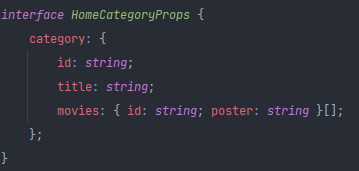

# Netflix_Clone

### Expo blank 와 tabs 차이점  (This Project uses tabs)
(1)  blank  
비어있고 한개의 페이지만 존재하는 프로젝트를 만드는 템플릿입.  

(2)  tabs  
react-navigation을 통해 여러 페이지가 만들어져있는 템플릿.  

### 사용한 라이브러리 (Library)
- expo install expo-av
- expo install @react-native-picker/picker
- 

### 공부내용
- expo  { Edit : userInterfaceStyle:"dark" ( background 색상 바뀜 )     'app.json()' }
- FlatList 속성 horizontal row로 flex 바뀜
- showsHorizontalScrollIndicator={false} { hide scrollBar }  
- 타입스크립트 Props  

- expo install expo-av

[comment]: <> (https://www.youtube.com/watch?v=CNaLOa-6X7U&t=641s)

[comment]: <> (34:30)

[comment]: <> (3-20)
